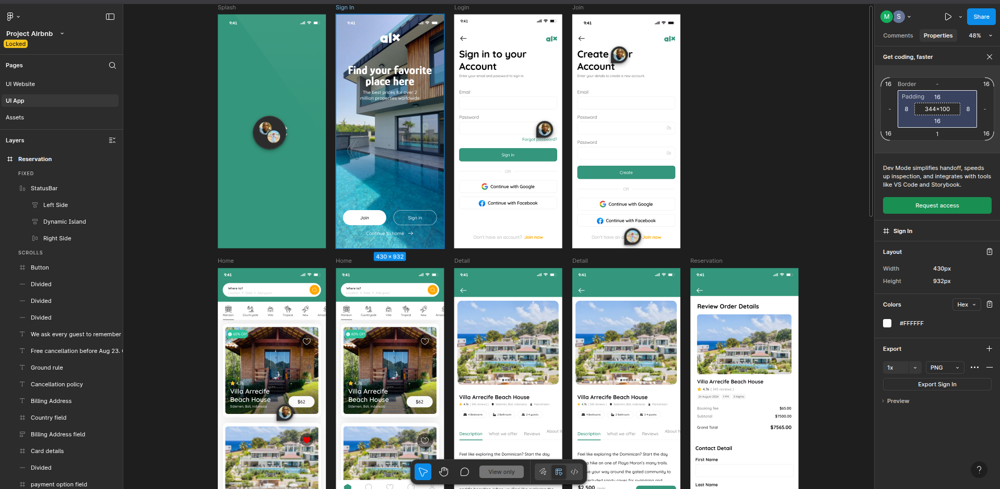

# Wireframing

## Introduction
Wireframing is the process of creating a visual blueprint of a digital product such as a website or mobile application. It outlines the structure, layout, and functionality of a user interface without focusing on design details like colors, images, or typography. Wireframes serve as a bridge between an idea and the final design, helping to visualize the user journey and overall flow of the product.

## Importance of Wireframing
Wireframing plays a crucial role in the design process because it:

- **Clarifies Structure**: Provides a clear overview of page layouts and navigation flow.  
- **Saves Time and Cost**: Helps identify potential issues early before development begins.  
- **Facilitates Collaboration**: Serves as a communication tool between designers, developers, and stakeholders.  
- **Focuses on User Experience (UX)**: Ensures usability and logical placement of elements before visual design is applied.  

By focusing on the “skeleton” of a product, wireframing ensures a strong foundation for creating user-friendly, functional, and aesthetically appealing designs.

## Key Elements of a Wireframe

1. **Layout Structure**  
   Defines the overall arrangement of sections on a page (e.g., header, body, sidebar, and footer).  
   *Example:* A homepage might have a header at the top for branding, a main body for content, and a footer for contact details. This helps ensure consistency and clarity in design.  

2. **Navigation**  
   Represents how users move between different pages or sections of the product. This often includes menus, links, or buttons.  
   *Example:* A navigation bar with links to *Home*, *About*, and *Contact* ensures users can easily explore the site without confusion.  

3. **Content Placement**  
   Refers to where text, images, and multimedia elements will appear. It ensures that important information is prioritized and visible.  
   *Example:* Placing a call-to-action button like *“Sign Up”* at the top of a landing page draws immediate user attention and increases engagement.  

4. **Functionality**  
   Shows how interactive elements (buttons, forms, sliders, etc.) will behave within the interface.  
   *Example:* A login form with input fields for *username* and *password* demonstrates where users enter data and how they access personalized content.  

These elements work together to provide clarity, guide user behavior, and establish a foundation for effective and efficient product design.

## Types of Wireframes

1. **Low-Fidelity Wireframes**  
   - **Description:** Simple sketches or digital outlines with basic shapes and placeholders. They avoid design details and focus only on structure and functionality.  
   - **When to Use:** Early in the design process to brainstorm ideas, validate layouts, and gather quick feedback without worrying about aesthetics.  
   - **Example:** Boxes for images, lines for text, and rough placement of buttons.  

2. **High-Fidelity Wireframes**  
   - **Description:** Detailed representations that include actual text, images, typography, and sometimes interactive elements. They closely resemble the final product design.  
   - **When to Use:** Later in the design process to refine details, test usability, and share with stakeholders or developers before moving into prototyping.  
   - **Example:** Screens with realistic content, styled buttons, navigation menus, and forms.  

---

## Wireframe Example

The attached image represents a **High-Fidelity Wireframe**.  
It includes detailed mobile app screens such as splash, sign-in, login, home feed, detailed listings, and reservation pages. These wireframes go beyond simple layouts — they showcase real text, structured content, icons, and functional buttons, making them closer to the final product.  

This type of wireframe is typically used to:  
- Communicate the full user flow across multiple screens.  
- Demonstrate interactions like signing in, joining, browsing listings, and making reservations.  
- Test usability and gather feedback from stakeholders or potential users before moving into development.

## Popular Wireframing Tools  

There are several tools available to create effective wireframes. Some of the most widely used include:  

- **Balsamiq** – Great for low-fidelity wireframes with a sketch-like feel.  
- **Adobe XD** – Offers both wireframing and prototyping with interactive elements.  
- **Sketch** – Popular among designers for macOS, used for UI/UX design.  
- **Figma** – A web-based collaborative tool for designing wireframes, mockups, and prototypes.  

### Why Figma?  
Figma is highly recommended for wireframing due to its:  
- **Collaboration features** – Multiple team members can design and comment in real-time.  
- **Cross-platform support** – Works seamlessly on Windows, macOS, Linux, and directly in the browser.  
- **Components and templates** – Reusable design elements save time and maintain consistency.  
- **Integration with prototyping** – Wireframes can be easily transformed into clickable prototypes to simulate user flows.  

Figma’s flexibility and accessibility make it one of the most powerful tools for translating requirements into clear visual wireframes.

## Benefits of Wireframing in Software Development  

Wireframing plays a crucial role in the software development process by providing a visual blueprint of the system before actual coding begins. Some key benefits include:  

- **Guides the Design Process**  
  Wireframes act as the foundation for UI/UX design. For example, in the booking management system, wireframing the **search and checkout flows** ensures that designers focus on usability and intuitive navigation before adding visual polish.  

- **Facilitates Clear Communication**  
  Wireframes make it easier for developers, designers, product managers, and stakeholders to stay aligned. Instead of lengthy requirement documents, a simple wireframe of the **room selection process** communicates the intended flow to everyone on the team.  

- **Identifies Issues Early**  
  By mapping out features like **login, booking, and payment**, potential usability or logical issues can be spotted and resolved at the planning stage, saving time and development costs later.  

- **Keeps Stakeholders Engaged**  
  Stakeholders can interact with low-fidelity wireframes of the booking system to provide feedback. This ensures the final product reflects the actual needs of the users and the business.  

In short, wireframes bridge the gap between **requirement analysis and design implementation**, ensuring the project stays on track from both technical and user-experience perspectives.

## Real-World Scenario: Wireframing in Action  

During the planning phase of a hotel booking system, the design team created wireframes for the **checkout flow**. Initially, the wireframe placed the **“Enter Payment Details”** step before the **“Review Booking Summary”** step.  

When stakeholders and test users interacted with the wireframe, they highlighted confusion:  
- Users wanted to confirm the room type, number of guests, and total price **before** providing sensitive payment information.  
- The sequence felt counterintuitive and increased the risk of cart abandonment.  

### Resolution  
Thanks to early feedback on the wireframe, the team restructured the checkout flow:  
1. **Booking Summary Review** was placed first.  
2. **Payment Details** were collected afterward, giving users confidence in their purchase.  
3. A **confirmation screen** was added to reassure users after successful payment.  

### Impact  
- **Improved Usability:** Users felt more comfortable and confident in completing their booking.  
- **Reduced Abandonment Rate:** Clear steps lowered the chances of users leaving mid-checkout.  
- **Development Efficiency:** The issue was identified early, saving the team from costly rework after implementation.  

### Conclusion  
This scenario demonstrates that wireframing is not just a design formality but a **critical step in ensuring usability and user trust**. By allowing teams to visualize, test, and refine workflows before development, wireframes act as a safeguard for delivering a **user-friendly, intuitive, and efficient product**.